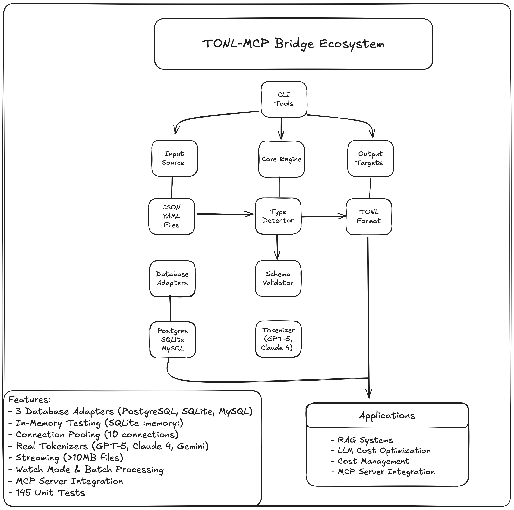

# TONL-MCP Bridge

> Reduce LLM token costs by 30-60%

[](https://www.npmjs.com/package/tonl-mcp-bridge)
[](https://www.npmjs.com/package/tonl-mcp-bridge)
[](https://github.com/kryptomrx/tonl-mcp-bridge/actions/workflows/test.yml)
[](https://tonl-mcp-bridge-docs.vercel.app)
[](https://www.typescriptlang.org/)
[](https://github.com/kryptomrx/tonl-mcp-bridge/blob/main/LICENSE)

Token-optimized data format for LLMs. TypeScript library with database adapters (PostgreSQL, MySQL, SQLite, Qdrant), CLI tools, and MCP server.

> **[View Full Documentation](https://tonl-mcp-bridge-docs.vercel.app)** - Complete guides, API reference, and examples


```bash
npm install tonl-mcp-bridge
```

**Quick example:**
```typescript
import { SQLiteAdapter } from 'tonl-mcp-bridge';

const db = new SQLiteAdapter(':memory:');
await db.connect();

const result = await db.queryWithStats('SELECT * FROM users', 'users');
console.log(`Saved ${result.stats.savingsPercent}% tokens`);
// Output: Saved 50.8% tokens
```

---

## Overview

TONL converts structured data (JSON/YAML/SQL) into a compact format that uses 30-60% fewer tokens. Works with datasets of 10+ similar objects.

**Best for:**
- RAG systems with database queries
- Bulk data transmission to LLMs
- Production systems where token costs matter

**Not for:**
- Single objects (header overhead)
- Inconsistent schemas
- Systems that need standard JSON output

---

## Installation

```bash
# Global (includes CLI tools)
npm install -g tonl-mcp-bridge

# Local
npm install tonl-mcp-bridge
```

---

## Quick Start

### With Databases

```typescript
import { SQLiteAdapter } from 'tonl-mcp-bridge';

// In-memory database - no setup needed
const db = new SQLiteAdapter(':memory:');
await db.connect();

// Create some data
await db.query('CREATE TABLE users (id INT, name TEXT, age INT)');
await db.query("INSERT INTO users VALUES (1, 'Alice', 25), (2, 'Bob', 30)");

// Query with token stats
const result = await db.queryWithStats('SELECT * FROM users', 'users');

console.log(result.tonl);
console.log(`Saved ${result.stats.savingsPercent}% tokens`);
```

### With JSON/YAML

```typescript
import { jsonToTonl, tonlToJson } from 'tonl-mcp-bridge';

const users = [
  { id: 1, name: "Alice", age: 25 },
  { id: 2, name: "Bob", age: 30 }
];

const tonl = jsonToTonl(users, "users");
// users[2]{id:i8,name:str,age:i8}:
//   1, Alice, 25
//   2, Bob, 30

const json = tonlToJson(tonl);
// Round-trip preserves data
```

### Token Statistics

```typescript
import { calculateRealSavings } from 'tonl-mcp-bridge';

const jsonStr = JSON.stringify(users);
const tonlStr = jsonToTonl(users);
const stats = calculateRealSavings(jsonStr, tonlStr, 'gpt-5');

console.log(`Token reduction: ${stats.savingsPercent}%`);
console.log(`Tokens saved: ${stats.savedTokens}`);
```

---

## Performance

### Token Savings by Dataset Size

| Dataset Size | JSON Tokens | TONL Tokens | Savings | Recommendation |
|--------------|-------------|-------------|---------|----------------|
| 1 object | 18 | 23 | -27.8% | Use JSON |
| 2 objects | 56 | 37 | 33.9% | Marginal |
| 10 objects | 280 | 165 | 41.1% | Use TONL |
| 100 objects | 2,800 | 1,450 | 48.2% | Use TONL |
| 1000 objects | 28,000 | 14,000 | 50.0% | Use TONL |

*Benchmarks with GPT-5 tokenizer*

### Real-World Example

Testing with 10 user records from PostgreSQL:

| Format | Tokens | Savings |
|--------|--------|---------|
| JSON | 431 | - |
| TONL | 212 | 50.8% |

**Cost impact (GPT-4 at $3/1M input tokens):**
- 1,000 queries/day: $19.50/month saved
- 10,000 queries/day: $195/month saved
- 100,000 queries/day: $1,950/month saved

### Model Compatibility

Tested with GPT-5, Claude 4, and Gemini 2.5 - all achieve 99%+ parsing accuracy in round-trip tests.

---

## CLI Usage

### File Conversion

```bash
# Convert single file
tonl convert data.json

# With statistics
tonl convert data.json -s

# Custom output
tonl convert data.json output.tonl --name users
```

### Batch Operations

```bash
# Convert multiple files
tonl batch "data/*.json"

# With statistics
tonl batch "data/*.json" -s

# Custom output directory
tonl batch "*.json" -o ./output
```

### Watch Mode

```bash
# Auto-convert on file changes
tonl watch "data/*.json"

# With options
tonl watch "*.json" --name collection -o ./output
```

### Tokenizer Models

```bash
# Specify model for accurate token counting
tonl convert data.json -s --model claude-4
tonl convert data.json -s --model gemini-2.5
```

**Supported:**
- `gpt-5` (default)
- `gpt-4`, `gpt-3.5-turbo`
- `claude-4-opus`, `claude-4-sonnet`, `claude-sonnet-4.5`
- `gemini-2.5-pro`, `gemini-2.5-flash`

---

## SDK for Database Integration

### Overview

The SDK connects directly to databases and converts query results to TONL automatically.

<details>
<summary>📊 View complete system architecture</summary>



Complete architecture showing CLI tools, database adapters, core engine, and application integration.

</details>

### SQLite

No external database needed - runs in-memory or from a file.

```typescript
import { SQLiteAdapter } from 'tonl-mcp-bridge';

// In-memory (for testing/prototyping)
const db = new SQLiteAdapter(':memory:');

// Or use a file
const dbFile = new SQLiteAdapter('myapp.db');

await db.connect();

// Create schema
await db.query('CREATE TABLE products (id INT, name TEXT, price REAL)');
await db.query("INSERT INTO products VALUES (1, 'Laptop', 999.99)");

// Query with TONL conversion
const result = await db.queryWithStats('SELECT * FROM products', 'products');
console.log(`Saved ${result.stats.savingsPercent}% tokens`);

await db.disconnect();
```

**Try it:**
```bash
npx tsx examples/sdk-sqlite-demo.ts
```

### PostgreSQL

Production-grade with connection pooling.

```typescript
import { PostgresAdapter } from 'tonl-mcp-bridge';

const db = new PostgresAdapter({
  host: 'localhost',
  port: 5432,
  database: 'myapp',
  user: 'admin',
  password: 'secret'
});

await db.connect();

// Simple query
const result = await db.query('SELECT * FROM users');

// With TONL conversion
const tonlResult = await db.queryToTonl('SELECT * FROM users', 'users');
console.log(tonlResult.tonl);

// With token statistics
const stats = await db.queryWithStats(
  'SELECT * FROM users',
  'users',
  { model: 'gpt-5' }
);

console.log(`Original: ${stats.stats.originalTokens} tokens`);
console.log(`TONL: ${stats.stats.compressedTokens} tokens`);
console.log(`Saved: ${stats.stats.savingsPercent}%`);

await db.disconnect();
```

**Try it with Docker:**
```bash
cd examples/sdk-demo
docker-compose up -d
npx tsx demo.ts
```

### MySQL

Enterprise MySQL/MariaDB support with connection pooling.

```typescript
import { MySQLAdapter } from 'tonl-mcp-bridge';

const db = new MySQLAdapter({
  host: 'localhost',
  port: 3306,
  database: 'myapp',
  user: 'admin',
  password: 'secret'
});

await db.connect();

const result = await db.queryWithStats(
  'SELECT * FROM orders WHERE status = "pending"',
  'orders'
);

console.log(`Retrieved ${result.rowCount} orders`);
console.log(`Saved ${result.stats.savingsPercent}% tokens`);

await db.disconnect();
```

**Features:**
- Connection pooling (10 connections default)
- Automatic reconnection
- Compatible with MySQL 5.7+ and MariaDB

### Qdrant (Vector Database)

Vector search with TONL conversion for RAG systems.

```typescript
import { QdrantAdapter } from 'tonl-mcp-bridge';

const db = new QdrantAdapter({
  url: process.env.QDRANT_URL || 'http://localhost:6333',
});

await db.connect();

// Create collection
await db.createCollection('documents', 384);

// Add vectors with metadata
await db.upsert('documents', [
  { 
    id: 1, 
    vector: embeddings, // Your 384-dimensional vector
    payload: { title: 'Doc 1', category: 'tech' } 
  },
]);

// Search with TONL conversion
const result = await db.searchWithStats(
  'documents',
  queryVector,
  { limit: 10, model: 'gpt-5' }
);

console.log(`Found ${result.rowCount} documents`);
console.log(`Saved ${result.stats.savingsPercent}% tokens`);

await db.disconnect();
```

**Features:**
- Docker: `docker run -p 6333:6333 qdrant/qdrant`
- Vector similarity search
- Filter support
- Payload metadata
- TONL conversion for efficient RAG

**Note:** Requires vector embeddings from models like OpenAI text-embedding-3, Cohere, or local alternatives.

---

### Batch Query Operations

Execute multiple queries in parallel with aggregate statistics.

```typescript
import { PostgresAdapter } from 'tonl-mcp-bridge';

const db = new PostgresAdapter(config);
await db.connect();

// Batch queries
const result = await db.batchQueryWithStats([
  { sql: 'SELECT * FROM users', name: 'users' },
  { sql: 'SELECT * FROM products', name: 'products' },
  { sql: 'SELECT * FROM orders', name: 'orders' },
], { model: 'gpt-5' });

console.log('Total queries:', result.aggregate.totalQueries);
console.log('Total rows:', result.aggregate.totalRows);
console.log('Total saved:', result.aggregate.savedTokens, 'tokens');
console.log('Savings:', result.aggregate.savingsPercent + '%');

// Individual results
result.results.forEach((r, i) => {
  console.log(`Query ${i + 1}: ${r.rowCount} rows, ${r.stats?.savingsPercent}% saved`);
});
```

**Example results (3 queries, 25 rows):**
- Original: 937 tokens
- TONL: 487 tokens
- Saved: 450 tokens (48%)

**Works with:**
- PostgreSQL
- MySQL
- SQLite
- Parallel execution

---

### Query Analyzer

Analyze queries before execution to estimate token savings and costs.

```typescript
import { PostgresAdapter } from 'tonl-mcp-bridge';

const db = new PostgresAdapter(config);
await db.connect();

const analysis = await db.analyzeQuery(
  'SELECT * FROM users',
  'users',
  { model: 'gpt-5' }
);

console.log('Estimated rows:', analysis.estimatedRows);
console.log('JSON tokens:', analysis.estimatedJsonTokens);
console.log('TONL tokens:', analysis.estimatedTonlTokens);
console.log('Savings:', analysis.potentialSavingsPercent + '%');
console.log('Cost impact:', analysis.costImpact, 'per call');
console.log('Recommendation:', analysis.recommendation);

// Output:
// Estimated rows: 10
// JSON tokens: 431
// TONL tokens: 212
// Savings: 50.8%
// Cost impact: $0.000657 per call
// Recommendation: use-tonl
```

**Recommendations:**
- `use-tonl` - Savings > 30%
- `marginal` - Savings 10-30%
- `use-json` - Savings < 10%

**Works with:**
- PostgreSQL
- MySQL
- SQLite

---

### Schema Drift Monitoring

Track schema changes and their impact on token savings.
```typescript
import { PostgresAdapter } from 'tonl-mcp-bridge';

const db = new PostgresAdapter(config);
await db.connect();

// Track baseline
await db.trackSchema('users');

// Later, detect drift
const drift = await db.detectSchemaDrift('users');

console.log('Schema changed:', drift.hasChanged);
console.log('New columns:', drift.newColumns);
console.log('Removed columns:', drift.removedColumns);
console.log('Type changes:', drift.typeChanges);
console.log('Savings impact:', drift.savingsImpact + '%');
console.log('Recommendation:', drift.recommendation);

// Update baseline if needed
if (drift.hasChanged) {
  await db.updateSchemaBaseline('users');
}

// Output:
// Schema changed: true
// New columns: ['status']
// Removed columns: []
// Type changes: []
// Savings impact: 50.3%
// Recommendation: Schema change improved savings. Update baseline.
```

**Features:**
- Detects new/removed columns
- Tracks type changes
- Calculates savings impact
- Provides recommendations
- Stores baselines locally in `.tonl-schemas/`

**Works with:**
- PostgreSQL
- MySQL
- SQLite

## API Reference

### Core Functions

#### jsonToTonl

```typescript
function jsonToTonl(
  data: Record<string, unknown>[],
  name?: string,
  options?: ConvertOptions
): string
```

Converts array of objects to TONL format.

**Parameters:**
- `data` - Array of objects with consistent schema
- `name` - Collection name (default: "data")
- `options.flattenNested` - Flatten nested objects (default: false)

**Returns:** TONL formatted string

**Throws:** Error if data is not an array or schema validation fails

#### tonlToJson

```typescript
function tonlToJson(tonl: string): Record<string, unknown>[]
```

Parses TONL back to JSON array.

**Parameters:**
- `tonl` - TONL formatted string

**Returns:** Array of objects

**Throws:** `TonlParseError` if format is invalid

#### calculateRealSavings

```typescript
function calculateRealSavings(
  jsonStr: string,
  tonlStr: string,
  model: ModelName
): TokenSavings
```

Calculates token savings using real tokenizer.

**Returns:**
```typescript
interface TokenSavings {
  originalTokens: number;
  compressedTokens: number;
  savedTokens: number;
  savingsPercent: number;
}
```

### YAML Support

```typescript
import { yamlToTonl, tonlToYaml } from 'tonl-mcp-bridge';

const yamlStr = `
- role: assistant
  context: technical
  tone: professional
`;

const tonl = yamlToTonl(yamlStr, 'prompts');
const yaml = tonlToYaml(tonl);
```

### Nested Objects

```typescript
const data = [{
  id: 1,
  user: { name: "Alice", email: "alice@example.com" },
  tags: ["developer", "typescript"]
}];

// Preserve nested structure
const tonl = jsonToTonl(data);
// data[1]{id:i8,user:obj,tags:arr}:
//   1, {name:Alice,email:alice@example.com}, [developer,typescript]

// Flatten nested objects
const tonlFlat = jsonToTonl(data, 'data', { flattenNested: true });
// data[1]{id:i8,user_name:str,user_email:str,tags:arr}:
//   1, Alice, alice@example.com, [developer,typescript]
```

---

## MCP Server

Model Context Protocol server for integration with Claude and other AI assistants.

### Starting the Server

```bash
# Start MCP server
npm run mcp:start

# Or using the binary
tonl-mcp-server
```

### Available Tools

1. **convert_to_tonl** - Convert JSON data to TONL format
2. **parse_tonl** - Parse TONL back to JSON
3. **calculate_savings** - Calculate token savings statistics

### Claude Desktop Integration

Add to `claude_desktop_config.json`:

```json
{
  "mcpServers": {
    "tonl": {
      "command": "node",
      "args": ["/path/to/tonl-mcp-bridge/dist/mcp/index.js"]
    }
  }
}
```

### Testing with MCP Inspector

```bash
npx @modelcontextprotocol/inspector node dist/mcp/index.js
```

---

## Architecture

```
Input Formats          Core Engine           Output
┌──────────┐          ┌──────────┐          ┌──────────┐
│   JSON   │─────────▶│   Type   │─────────▶│   TONL   │
│   YAML   │          │ Detector │          │  Format  │
└──────────┘          └──────────┘          └──────────┘
                           │
                      ┌──────────┐
                      │  Schema  │
                      │Validator │
                      └──────────┘
                           │
                      ┌──────────┐
                      │Tokenizer │
                      │ (Real)   │
                      └──────────┘
```

**Core components:**
- Type detection and optimization
- Schema validation across all objects
- Real tokenizer integration (js-tiktoken)
- Bidirectional conversion with data preservation
- Streaming support for large files

---

## Type System

TONL automatically selects optimal numeric types:

```typescript
{ id: 1 }         // i8  (1 byte, -128 to 127)
{ id: 1000 }      // i16 (2 bytes, -32,768 to 32,767)
{ id: 100000 }    // i32 (4 bytes, -2B to 2B)
{ price: 19.99 }  // f32 (32-bit float)
{ score: 3.14159265359 } // f64 (64-bit float)
```

**Supported types:**
- Integers: `i8`, `i16`, `i32`, `i64`
- Floats: `f32`, `f64`
- Strings: `str`
- Booleans: `bool`
- Special: `date`, `datetime`, `null`, `obj`, `arr`

---

## Development

### Setup

```bash
git clone https://github.com/kryptomrx/tonl-mcp-bridge.git
cd tonl-mcp-bridge
npm install
```

### Testing

```bash
npm test                 # Run tests
npm run test:watch       # Watch mode
npm run test:coverage    # Coverage report
```

### Building

```bash
npm run build
```

### Code Quality

```bash
npm run lint      # Linting
npm run format    # Formatting
```

---

## Roadmap

### ✅ v0.8.0 (Released 2025-11-23)
- Qdrant vector database adapter
- Batch query operations (48% savings)
- Query analyzer with cost estimation
- Schema drift monitoring
- 162 tests
- Complete TypeScript SDK

### 🚧 v0.9.0 (Q1 2025 - Planned)
- MCP streaming HTTP support
- More vector DBs (Milvus, Weaviate, Pinecone)
- Query analyzer advanced features (sampling, caching)
- LangChain integration
- LlamaIndex integration

---

## Benchmarks

**Operation performance (100 objects):**

| Operation | Time | Throughput |
|-----------|------|------------|
| JSON → TONL | 2.3ms | 43,478 ops/sec |
| TONL → JSON | 1.8ms | 55,555 ops/sec |
| Streaming (10MB) | 145ms | 68 MB/sec |
| Batch (50 files) | 89ms | 561 files/sec |

**Memory:**
- Small files (<1MB): ~15MB
- Large files (10MB+): Streaming mode (~50MB peak)

---

## Known Limitations

1. **Header overhead** - Single objects use more tokens due to schema header
2. **Schema consistency** - Works best with consistent object structure
3. **Parsing requirement** - Receiving system must support TONL format
4. **Browser compatibility** - Watch mode requires Node.js
5. **Numeric precision** - Float type selection may affect precision in edge cases

---

## Contributing

Contributions welcome:

1. Fork the repo
2. Create a feature branch
3. Write tests
4. Ensure all tests pass
5. Submit pull request

See [CONTRIBUTING.md](CONTRIBUTING.md) for details.

---

## License

MIT License - see [LICENSE](LICENSE) file

---

## Related Projects

This project builds on the [TONL format](https://github.com/tonl-dev/tonl) by Ersin Koç, focusing on database integration and production tooling. For CLI tools and document queries, see the original TONL project.

---


## Links

- [Documentation](https://tonl-mcp-bridge-docs.vercel.app)
- [npm package](https://www.npmjs.com/package/tonl-mcp-bridge)
- [GitHub](https://github.com/kryptomrx/tonl-mcp-bridge)
- [Issues](https://github.com/kryptomrx/tonl-mcp-bridge/issues)
- [Changelog](CHANGELOG.md)

---

## Support

Found a bug? Have a feature request? [Open an issue](https://github.com/kryptomrx/tonl-mcp-bridge/issues).

For questions, use [GitHub Discussions](https://github.com/kryptomrx/tonl-mcp-bridge/discussions).

---

⭐ **Star on GitHub** if you find this useful!

Built by [@kryptomrx](https://github.com/kryptomrx)